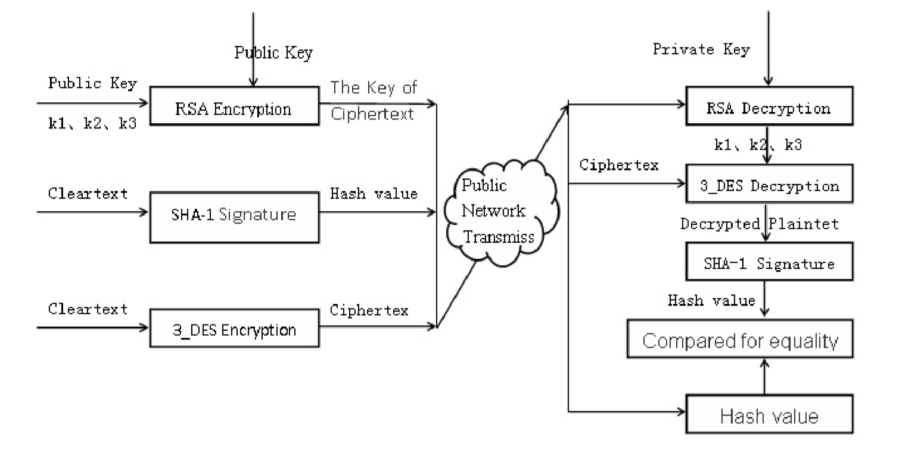
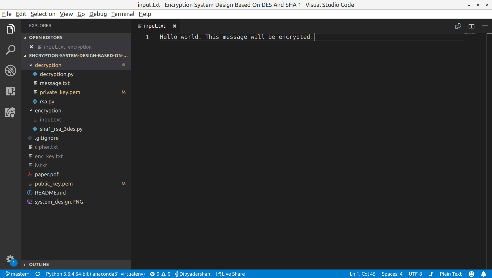
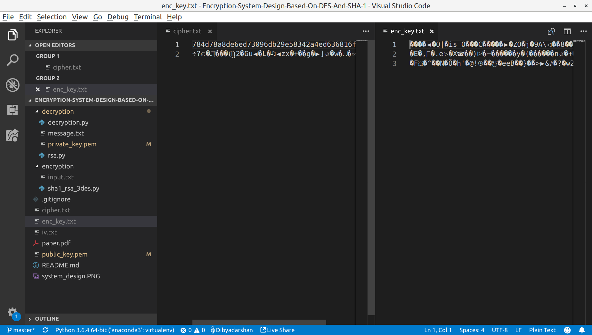
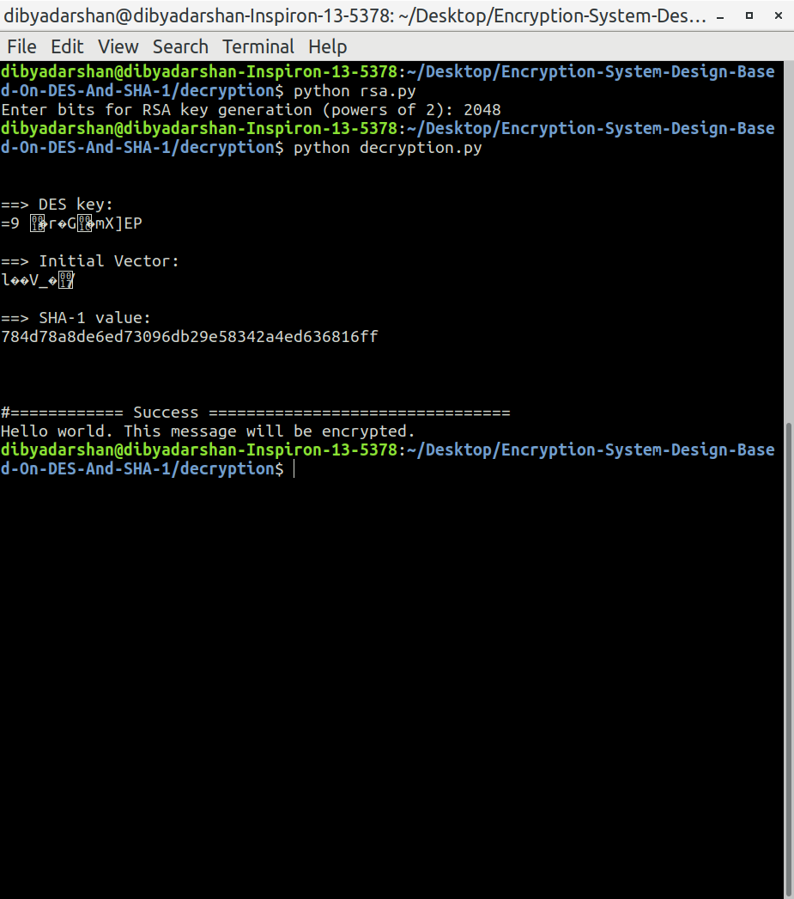

# Encryption System Design Based On DES And SHA-1
Implementation of the paper https://ieeexplore.ieee.org/document/6385298 by Jian Zhang, Xuling Jin

### Course: 
Number Theory and Cryptography (CO313)

### Contributors: 
- Dibyadarshan Hota (16CO154)
- Omkar Prabhu (16CO233)

### System Design



- 3_DES in CBC mode

### Installation
```
$ pip3 install pycrypto
```
### Screenshots

#### RSA Key Generation


#### Plaintext


#### Encryption


#### Encrypted Files


#### Decryption


### Usage


### File Structure
