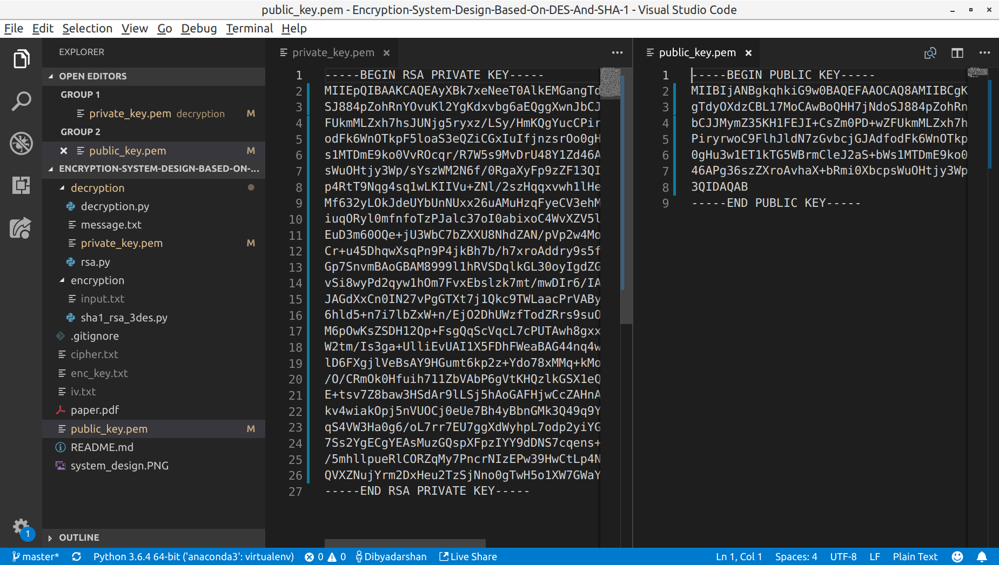
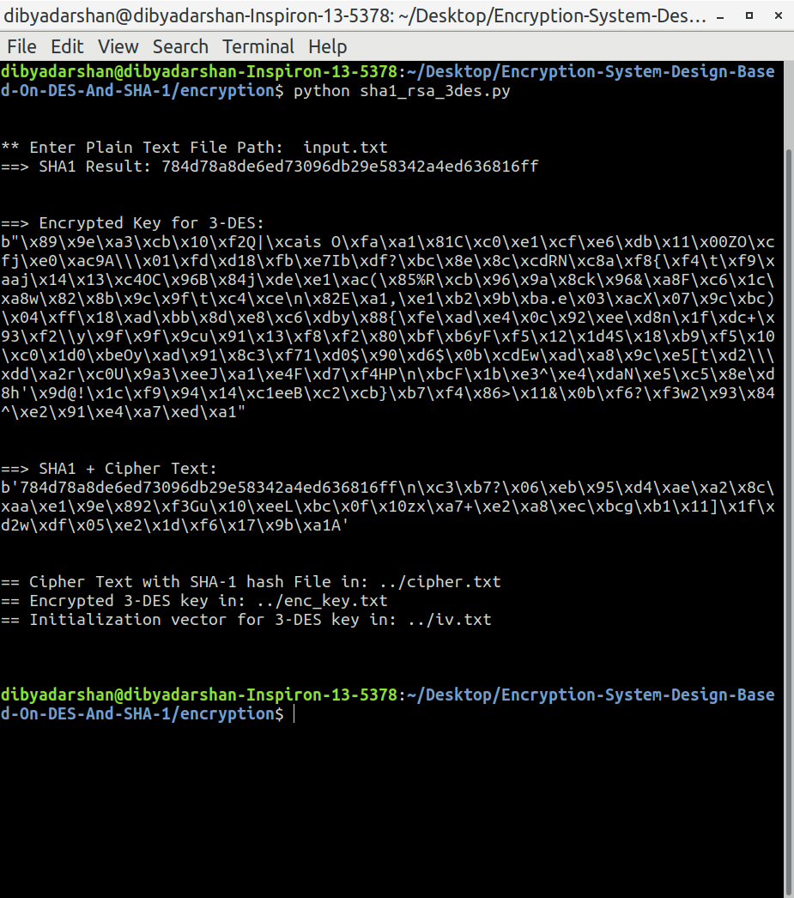

# Encryption System Design Based On DES And SHA-1
Implementation of the paper https://ieeexplore.ieee.org/document/6385298 by Jian Zhang, Xuling Jin

### Course: 
Number Theory and Cryptography (CO313)

### Contributors: 
- Dibyadarshan Hota (16CO154)
- Omkar Prabhu (16CO233)

### System Design


- 3_DES in CBC mode

### Installation
```
$ pip3 install pycrypto
```

### Usage

0. RSA Public-Private key gen
```
$ cd decryption
$ python3 rsa.py
```

1. Encryption
```
$ cd encryption
$ python3 sha1_rsa_3des.py
```

2. Decryption
```
$ cd decryption
$ python3 decryption.py
```

### File Structure
- `encryption/sha1_rsa_3des.py` - Contains encryption code for the system
- `decryption/rsa.py` - Generated Public and Private keys 
- `decryption/decryption.py` - Contains decryption code for the system
- `decryption/private_key.pem` - Private key generated by `decryption.py`
- `public_key.pem` - Private key generated by `decryption.py`
- `results/` - Contains screenshots of results
- `paper.pdf` - Research Paper 
- `decryption/message.txt` - Decrypted message
- `cipher.txt` - Cipher text + SHA1 Hash 
- `enc_key.txt` -  Encrypted Keys for 3DES
- `iv.txt` - Initial vector required for 3DES 

 
### Results

#### RSA Key Generation


#### Plaintext


#### Encryption


#### Encrypted Files


#### Decryption


